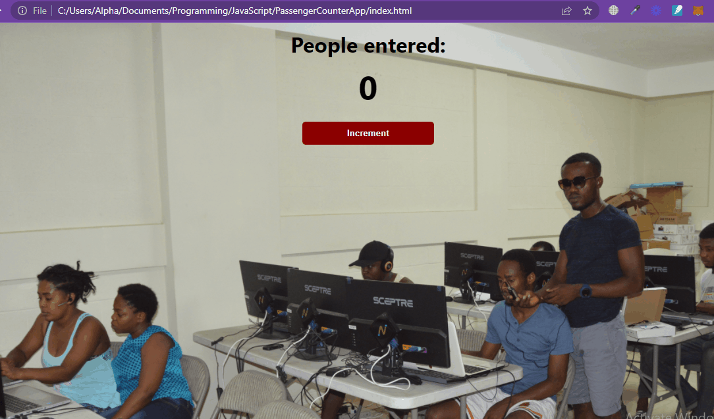

# passengerCounterapp2022

**passengerCounterapp2022** is a web app that allows a user to count passenger entering somewhere.

It's a work that I had to done with the Scrimba JavaScript Course. 

## Video Walkthrough

Here's a walkthrough of implemented user stories:

GIF created with [ScreenToGif].

